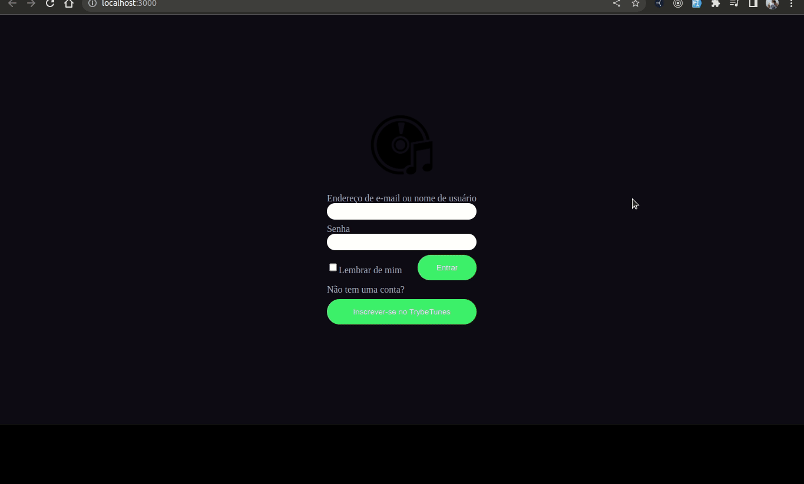

<h1 align="center">
Projeto TrybeTunes!
</h1> 



## :books: Contexto
Esse projeto simula uma Streaming de musicas aonde foi utilizado a api do Itunes para fazer a busca no banco de dados. Me inspirei no aplicativo do spotify para fazer o template do site. Ainda esta em construção e tem bastante coisa para aprimorar, porem ja esta em funcionamento e ja é possivel escutar as suas musicas!


## :man_technologist: Tecnologias, bibliotecas e arquiteturas usadas
  * __React__
  * __React Router Dom__

# Instruções da aplicação
### Instalar dependências
```
cd Projeto-TrybeTunes
npm install
```

### Iniciar Projeto
```
npm start
```
